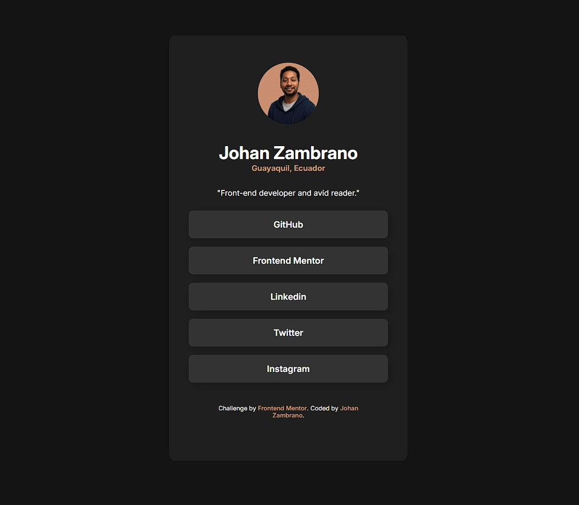

# Frontend Mentor - Social Links Profile Solution

This is a solution to the [Social links profile challenge on Frontend Mentor](https://www.frontendmentor.io/challenges/social-links-profile-UG32l9m6dQ). Frontend Mentor challenges help you improve your coding skills by building realistic projects.

## Table of contents

- [Overview](#overview)
  - [The challenge](#the-challenge)
  - [Screenshot](#screenshot)
  - [Links](#links)
- [My process](#my-process)
  - [Built with](#built-with)
  - [What I learned](#what-i-learned)
  - [Continued development](#continued-development)
  - [Useful resources](#useful-resources)
- [Author](#author)
- [Feedback & Contributions](#feedback--contributions)

## Overview

### The challenge

Users should be able to:

- See hover and focus states for all interactive elements on the page
- View the profile on different screen sizes with responsive design
- Access social media links (when URLs are added)

### Screenshot



*The social links profile showing personal information and interactive buttons*

### Links

- Solution URL: [GitHub Repository](https://github.com/jazs790715/Social-links-profile)
- Live Site URL: [GitHub Pages](https://jazs790715.github.io/Social-links-profile/)

## My process

### Built with

- Semantic HTML5 markup
- CSS custom properties (CSS Variables)
- Flexbox for layout
- Mobile-first workflow
- Google Fonts (Inter family)
- Modern CSS features (hover states, border-radius)

**Custom Modifications:**
- Personalized color palette (modified from original design)
- Custom GitHub avatar integration
- Personal information and branding

### What I learned

During this project, I reinforced my understanding of several key concepts and made several custom modifications:

**Custom Color Palette**: I customized the original color scheme to create a more personalized dark theme with warm accent colors, moving away from the default Frontend Mentor colors to create a unique visual identity.

**Personal Avatar Integration**: Instead of using the provided avatar image, I integrated my own GitHub profile picture directly from the GitHub API (https://avatars.githubusercontent.com/u/7389361?v=4), making the profile truly personal.

**CSS Custom Properties for consistent theming:**
```css
:root {
  --primary-color: hsl(75, 94%, 57%);
  --secundary-color: rgb(207, 156, 108);
  --Grey-700: hsl(0, 0%, 20%);
  --Grey-800: hsl(0, 0%, 12%);
  --Grey-900: hsl(0, 0%, 8%); 
}
```

**Flexbox for centering and layout:**
```css
.social-links {
  display: flex;
  flex-direction: column;
  align-items: center;
  padding: 50px 35px;
  background-color: var(--Grey-800);
}
```

**Interactive hover effects:**
```css
.style-button:hover {
  background-color: var(--secundary-color);
  color: white;
  cursor: pointer;
}
```

**Semantic HTML structure:**
```html
<section id="header">
  <div id="avatar">
    
  </div>
  <p id="name">Johan Zambrano</p>
  <p id="location">Guayaquil, Ecuador</p>
  <p>"Front-end developer and avid reader."</p>
</section>
```

### Continued development

Areas I want to focus on in future projects:

- **Accessibility improvements**: Adding proper ARIA labels and keyboard navigation
- **Advanced CSS Grid**: Exploring more complex layouts with CSS Grid
- **CSS Animations**: Adding subtle transitions and animations for better user experience
- **Performance optimization**: Implementing lazy loading for images and optimizing CSS
- **JavaScript interactivity**: Adding dynamic features like theme switching

### Useful resources

- [CSS Custom Properties Guide](https://developer.mozilla.org/en-US/docs/Web/CSS/Using_CSS_custom_properties) - Helped me implement consistent theming throughout the project
- [Flexbox Complete Guide](https://css-tricks.com/snippets/css/a-guide-to-flexbox/) - Essential for understanding the layout structure
- [Inter Font Family](https://fonts.google.com/specimen/Inter) - Perfect typography choice for modern web design
- [CSS Hover Effects](https://www.w3schools.com/css/css_pseudo_classes.asp) - Understanding pseudo-classes for interactive elements

## Author

- Website - [Johan Zambrano](https://github.com/jazs790715)
- Frontend Mentor - [@jazs790715](https://www.frontendmentor.io/profile/jazs790715)
- GitHub - [@jazs790715](https://github.com/jazs790715)
- Location - Guayaquil, Ecuador

---

## Project Structure

```
Social-links-profile/
├── assets/
│   ├── fonts/
│   │   ├── static/
│   │   │   ├── Inter-Bold.ttf
│   │   │   ├── Inter-Regular.ttf
│   │   │   └── Inter-SemiBold.ttf
│   │   ├── Inter-VariableFont_slnt,wght.ttf
│   │   └── OFL.txt
│   └── images/
│       ├── avatar-jessica.jpeg
│       └── favicon-32x32.png
├── design/
│   ├── active-states.jpg
│   ├── desktop-design.jpg
│   └── mobile-design.jpg
├── index.html
├── style.css
├── style-guide.md
├── preview.jpg
└── README.md
```

## Features

- ✨ **Responsive Design**: Works on mobile and desktop devices
- 🎨 **Custom Color Scheme**: Personalized dark theme with warm accent colors (customized from original design)
- 🖼️ **Personal Avatar**: Custom GitHub profile image integration (replaced default avatar)
- 🔗 **Social Links**: Ready-to-use buttons for all major platforms
- ⚡ **Hover Effects**: Interactive button states
- 🎯 **Semantic HTML**: Proper structure and accessibility considerations
- 📱 **Mobile-First**: Optimized for mobile devices first

## Feedback & Contributions

💬 **I welcome all feedback!** Whether you're a fellow developer, designer, or just someone browsing through my work, your insights are incredibly valuable to me.

I'm particularly interested in feedback about:
- **Code quality and best practices**: Any suggestions for cleaner, more efficient code
- **Design improvements**: Ideas for better UI/UX or visual enhancements  
- **Accessibility**: Ways to make the site more accessible to all users
- **Performance optimizations**: Suggestions for faster loading and better performance
- **Development process**: Tips on workflow, tools, or methodologies

Feel free to:
- Open an issue on GitHub
- Leave comments on my Frontend Mentor solution
- Connect with me on social media
- Share your thoughts via email or any platform

**Every piece of feedback helps me grow as a developer!** 🚀

---

Challenge by [Frontend Mentor](https://www.frontendmentor.io?ref=challenge). Coded by [Johan Zambrano](https://github.com/jazs790715).
